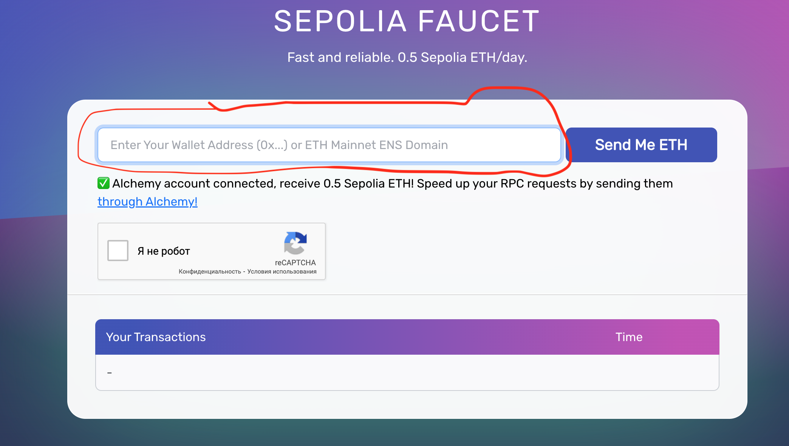

# Деплой Смарт Контракта Taiko

#### 1. Получение тестовых токенов
Перым делом нам надо получить Sepolia ETH для оплаты комиссии на газ за деплой. Если у вас уже есть тестовые токены - пропускайте этот шаг и переходите к следующему.
На выбор у нас несколько кранов:
https://taiko.xyz/docs/guides/build-on-taiko/receive-tokens#receive-sepolia-eth. Воспользуемся https://sepoliafaucet.com. Логинимся через свой Google Аккаунт

Вставляем свой адерс и нажимаем Send Me ETH

#### 2. Деплой
Переходим на сайт https://remix.ethereum.org
Выбираем смарт контракт storage.sol

 
Компилируем контракт

И последний шаг - деплой. 
В списке Environment выбираем Injected Provider - Metamask и нажимаем Deploy

Подтверждаем транзакцию

Деплой успешно выполнен. Можно посмотреть транзакцию в Etherscan. Еще раз подтверждаем транзакцию

#### 
