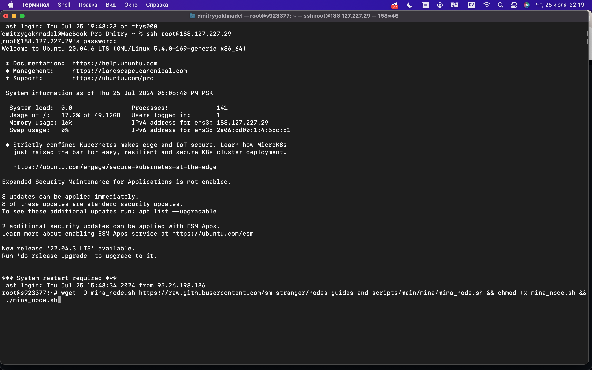

   # Mina. Установка и запуск

   Первым делом вставляем флэшку и копируем файлы на сервер через FileZilla
   

   ```
   wget -O mina_node.sh https://raw.githubusercontent.com/sm-stranger/nodes-guides-and-scripts/main/mina/mina_node.sh && chmod +x mina_node.sh && ./mina_node.sh
   ```
   
   
