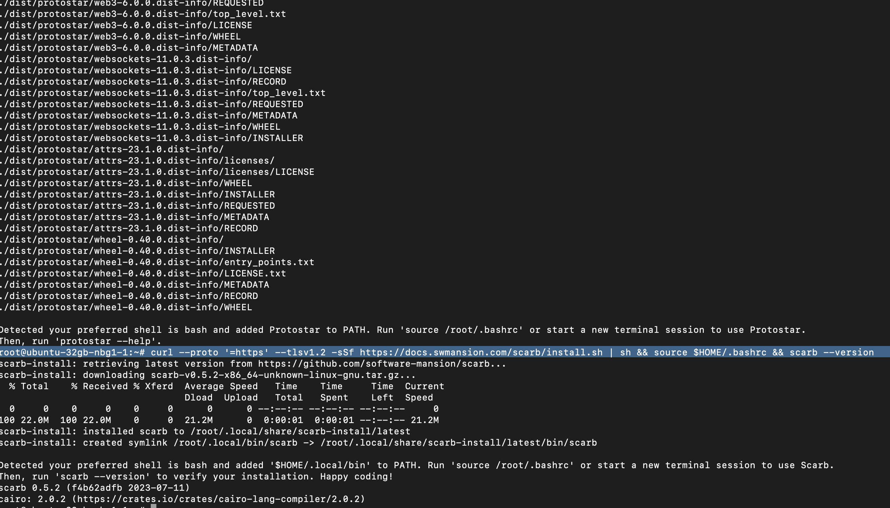
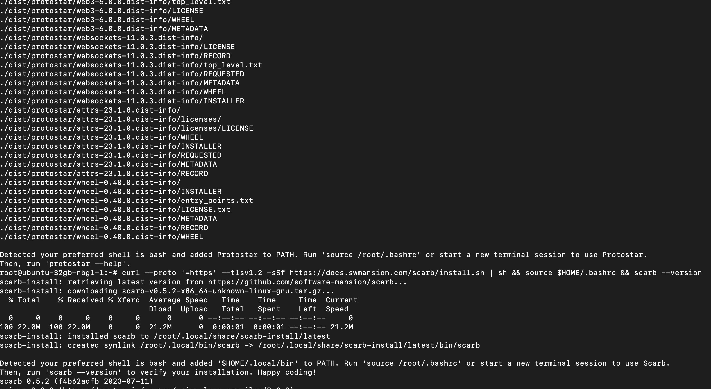
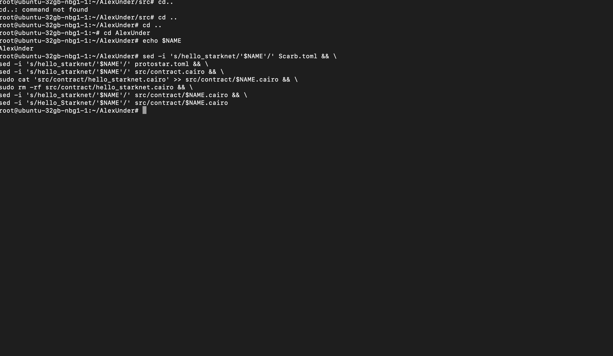

В этом гайде мы рассмотрим деплой смарт контракта Starknet с помощью Protostar, набора инструментов для разработки смарт контарктов Starknet на языке Cairo. Предполагается что у вас уже есть сервер и вы подключились к нему с помощью какого-либо SSH-клиента.

<br>

#### Обновляем систему
```
sudo apt update && sudo apt upgrade -y
```

<br>

#### Устанавливаем Protostar, набор инструментов для разработки смарт-контарктов для Starknet на языке Cairo
```
curl -L https://raw.githubusercontent.com/software-mansion/protostar/master/install.sh | bash && source $HOME/.bashrc
```


<br>

#### Устанавливаем Scarb, менеджер пакетов Cairo
```
curl --proto '=https' --tlsv1.2 -sSf https://docs.swmansion.com/scarb/install.sh | sh && source $HOME/.bashrc && scarb --version
```


<br>

#### Далее устанавливаем переменные PK (Private Key).
```
PK="Your_Private_Key"
```


<br>

#### Записываем ее в .bashrc
```
echo 'export PK='$PK >> $HOME/.bashrc && source $HOME/.bashrc
```


<br>

#### По такому же принципу записываем адрес кошелька и имя контракта в переменные ADDRESS и NAME
```
ADDRESS="Your_Address"
```


```
NAME="contract_name"
```


<br>

#### Также записываем эти переменные в файл профиля .bashrc
```
echo 'export ADDRESS='$ADDRESS >> $HOME/.bashrc && echo 'export NAME='$NAME >> $HOME/.bashrc source $HOME/.bashrc
```


<br>

#### Инициализируем контракт
```
protostar init $NAME
```


#### Переходим в директорию созданного проекта
```
cd $NAME
```

<br>

#### Записываем свое имя смарт контракта
```
sed -i 's/hello_starknet/'$NAME'/' Scarb.toml && \
sed -i 's/hello_starknet/'$NAME'/' protostar.toml && \
sed -i 's/hello_starknet/'$NAME'/' src/contract.cairo && \
sudo cat 'src/contract/hello_starknet.cairo' >> src/contract/$NAME.cairo && \
sudo rm -rf src/contract/hello_starknet.cairo && \
sed -i 's/hello_starknet/'$NAME'/' src/contract/$NAME.cairo && \
sed -i 's/Hello_Starknet/'$NAME'/' src/contract/$NAME.cairo
```


<br>

#### Билдим проект
```
protostar build --contract-name $NAME
```


#### Записываем полученный хэш
```
HASH="0x......"
```


#### Записываем переменную $PK в файл .env
```
echo $PK > .env
```

#### Объявляем контракт
```
protostar declare $NAME \
    --account-address $ADDRESS \
    --max-fee auto \
    --private-key-path ./.env \
    --network mainnet
```

#### Деплой
```
protostar deploy $HASH \
    --account-address $ADDRESS \
    --max-fee auto \
    --private-key-path ./.env \
    --network mainnet
```


