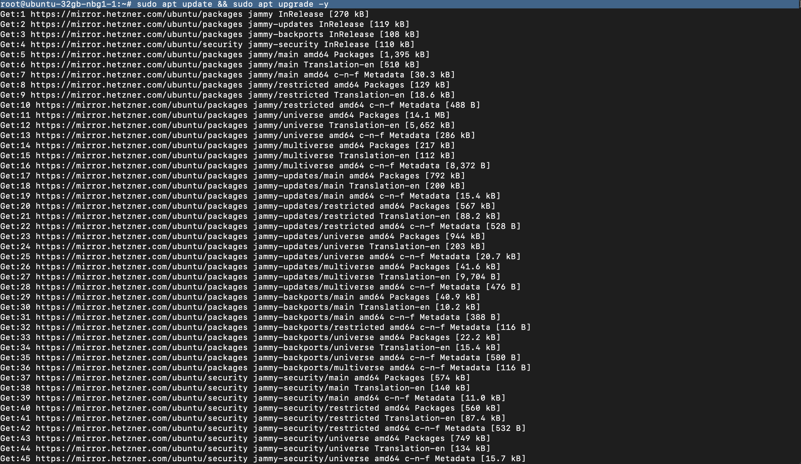
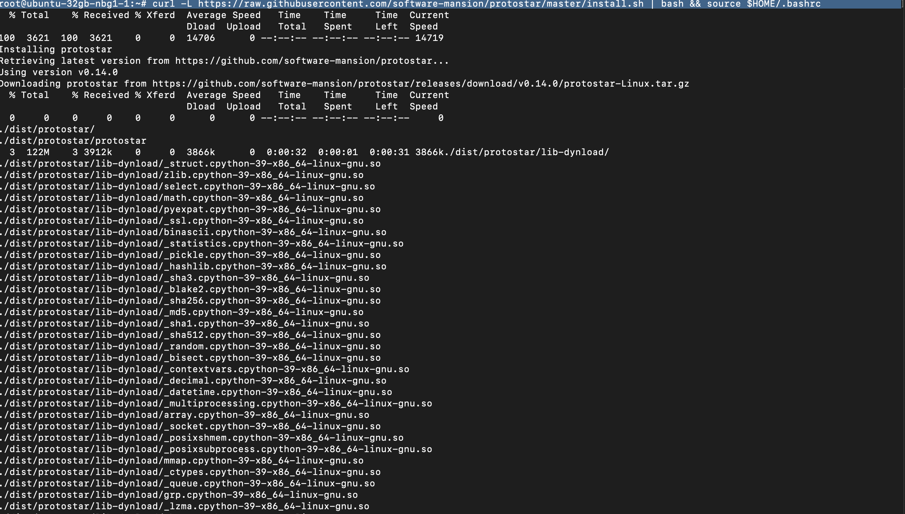
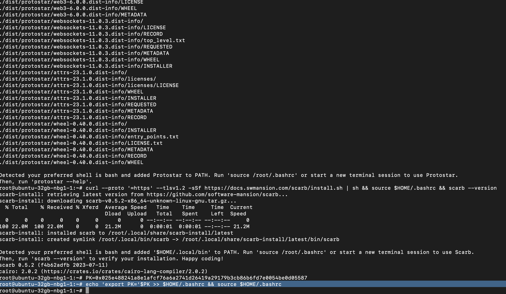

В этом гайде мы рассмотрим деплой смарт контракта Starknet. Мы будем использовать Protostar, набор инструментов для разработки смарт контарктов для Starknet на языке Cairo. Можно воспользоваться скриптом. Для тех кому интересен пошаговый процесс - расписано ниже. Предполагается что у вас уже есть сервер.

<br>

#### Обновляем систему
```
sudo apt update && sudo apt upgrade -y
```

<br>

#### Устанавливаем Protostar, набор инструментов для разработки смарт-контарктов для Starknet на языке Cairo
```
curl -L https://raw.githubusercontent.com/software-mansion/protostar/master/install.sh | bash && source $HOME/.bashrc
```


<br>

#### Устанавливаем Scarb, менеджер пакетов Cairo
```
curl --proto '=https' --tlsv1.2 -sSf https://docs.swmansion.com/scarb/install.sh | sh && source $HOME/.bashrc && scarb --version
```


<br>

#### Далее устанавливаем переменные PK (Private Key).
```
PK="Your_Private_Key"
```


<br>

#### Записываем ее в .bashrc
```
echo 'export PK='$PK >> $HOME/.bashrc && source $HOME/.bashrc
```


<br>

#### По такому же принципу записываем адрес кошелька и имя контракта в переменные ADDRESS и NAME
```
ADDRESS="Your_Address"
```

```
NAME=
```

<p>

#### Также записываем эти переменные в файл профиля .bashrc
```
echo 'export ADDRESS='$ADDRESS >> $HOME/.bashrc && echo 'export NAME='$NAME >> $HOME/.bashrc source $HOME/.bashrc
```
</p>


#### Записываем имя контракта в переменную NAME. 
```
NAME="Your_Project_Name"
```

#### Инициализируем контракт
```
protostar init $NAME
```

#### Переходим в директорию созданного проекта
```
cd $NAME
```


#### Меняем название контракта на свое
```
sed -i 's/hello_starknet/'$NAME'/' Scarb.toml && \
sed -i 's/hello_starknet/'$NAME'/' protostar.toml && \
sed -i 's/hello_starknet/'$NAME'/' src/contract.cairo && \
sudo cat 'src/contract/hello_starknet.cairo' >> src/contract/$NAME.cairo && \
sudo rm -rf src/contract/hello_starknet.cairo && \
sed -i 's/hello_starknet/'$NAME'/' src/contract/$NAME.cairo && \
sed -i 's/Hello_Starknet/'$NAME'/' src/contract/$NAME.cairo
```

#### Билдим проект
protostar build --contract-name $NAME


#### Записываем полученный хэш
```
HASH="0x......"


```
